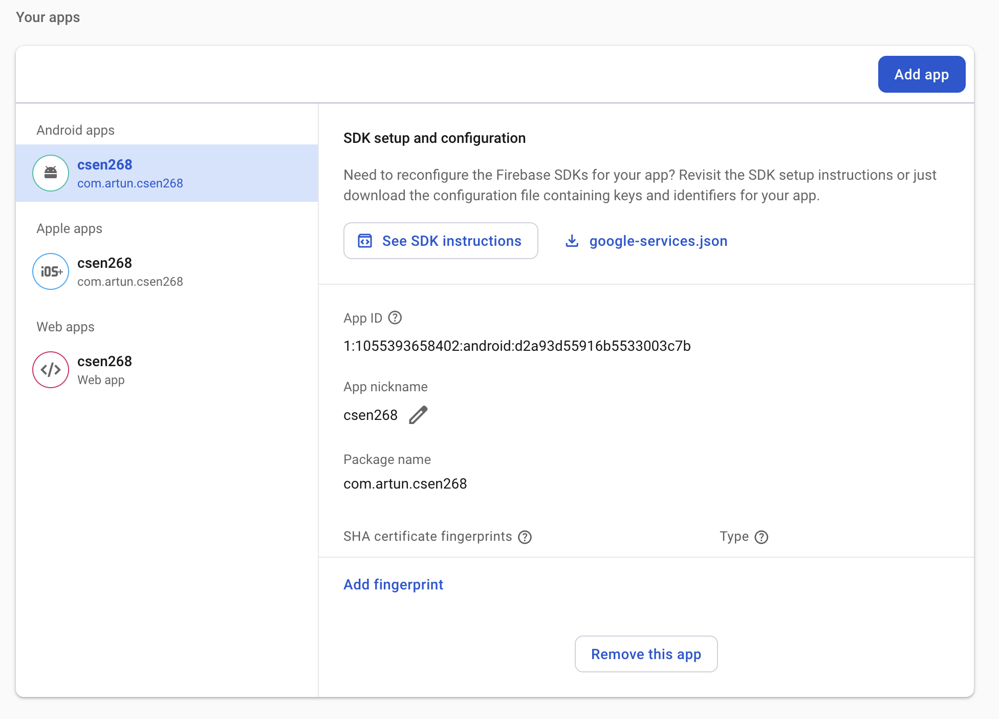

# Lecture 10 - Part 1 - Firebase Firestore

In this part, we aim to connect to Firestore database

## Packages

We add the following packages:
```zsh
flutter pub add cloud_firestore firebase_core firebase_auth
```

## Create a firebase project

Follow the instructions to create a project in Firebase

## Add iOS, Android, and Web Apps

Follow the instructions to add the the apps with the correct package names etc.



## Flutterfire configuration

```zsh
firebase login
```
to login to firebase with your Google account. Then run 
```zsh
flutterfire configure
```
Here you shall select the project and choose to configure Web, iOS, and Android only.

## FirebaseOptions 

This creates `firebase_options.dart` file for you. Which is incorporated into the `main.dart` as follows:
```dart
void main() async {
  WidgetsFlutterBinding.ensureInitialized();
  await Firebase.initializeApp(options: DefaultFirebaseOptions.currentPlatform);

  runApp(const MyApp());
}
```

## Initialize Firestore
In the firebase console, you initialize Firestore and set `testing` mode to enable **unauthenticated** access.


## Accessing Database
The commands to access the database are incorporated in to the cubit
```dart
  final db = FirebaseFirestore.instance;

  Future<void> getUsers() async {
    var qs = await db.collection('users').get();
    users = qs.docs.map((doc) => User.fromMap(doc.data())).toList();
  }

  void insertUser(User user) async {
    emit(DatabaseLoading());
    // await db.collection('users').add(user.toMap());
    await db.doc('users/${user.uid}').set(user.toMap());
    await getUsers();
    emit(DatabaseLoaded(users: users));
  }
```


